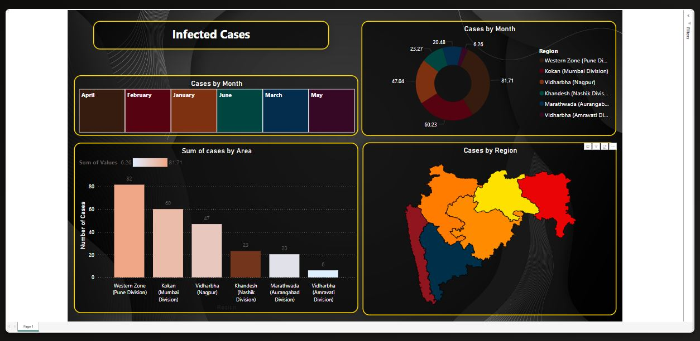
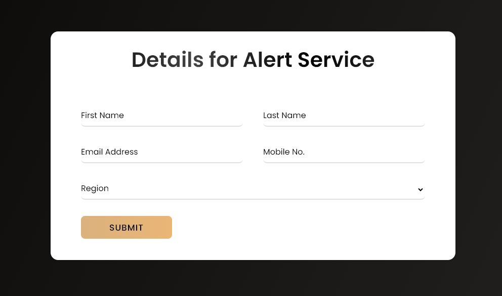
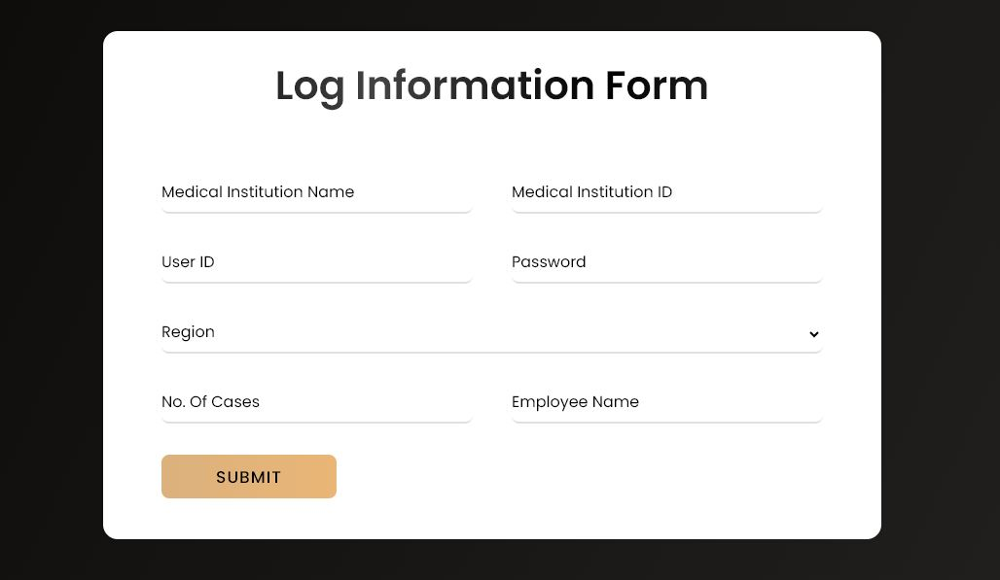
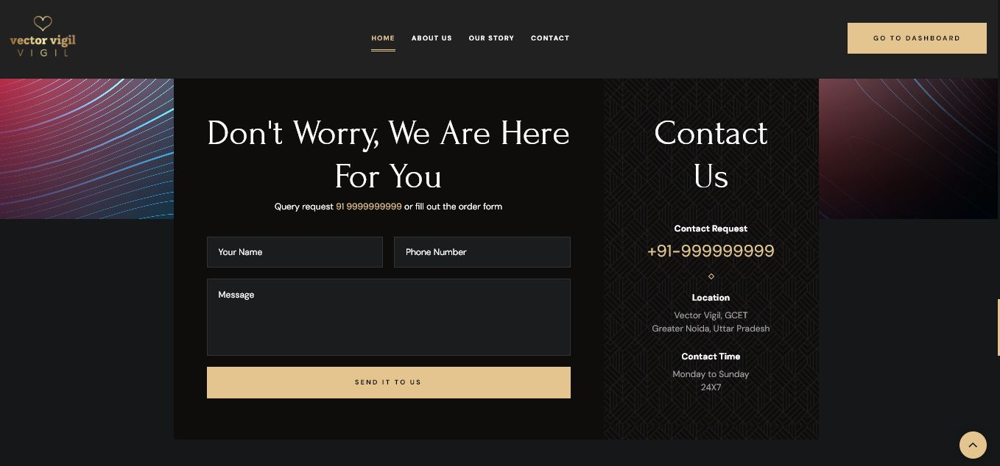

# Vector Vigil

Vector Vigil is a tool designed to predict the number of dengue cases based on weather conditions using time series analysis. The application provides a dashboard for visualizing predicted values over time and allows users to receive alert notifications if cases rise in their neighborhood. Authorities can enter the number of cases to help train the model, ensuring reliable data sources.

## Features

1. **Dengue Case Prediction**:
    - Predict the number of dengue cases based on weather conditions.
    - Display predicted values over months in a dashboard.
    - Receive alert notifications if cases rise in your neighborhood.

2. **Data Entry for Authorities**:
    - Authorities working in hospitals can log in to enter the number of cases.
    - Ensures reliable data sources with a login password system.

## Technology Stack

- **Front-end**: HTML, CSS, JavaScript
- **Back-end**: Python
- **Prediction Model**: Time Series Analysis
- **Data Source**: Indian Meteorological Department 

## Installation

1. Clone the repository:
    \`\`\`bash
    git clone [https://github.com/your-username/Vector-Vigil.git](https://github.com/ShushantSharma372/Vector-Vigil.git)
    cd VectorVigil
    \`\`\`

2. Create and activate a virtual environment (optional but recommended):
    \`\`\`bash
    python3 -m venv venv
    source venv/bin/activate   # On Windows, use `venv\Scripts\activate`
    \`\`\`

3. Install the required dependencies:
    \`\`\`bash
    pip install -r requirements.txt
    \`\`\`

4. Change the Database configurations according to your MySQL account.

## Usage

1. Run the application:
    \`\`\`bash
    python app.py
    \`\`\`

2. Open your web browser and navigate to \`http://127.0.0.1:8050/\`.

3. View the predicted dengue cases over time in the dashboard.

4. For authorities, log in to enter the number of cases and help train the model.

## Screenshots

### Website

### Dengue Case Prediction Dashboard

### Data Entry for Users for alert service

### Data Entry for Authorities

### Quries and Doubts 

## Contributing

Contributions are welcome! Please fork the repository and create a pull request with your changes. Ensure that your code follows the project's coding standards and includes relevant tests.

